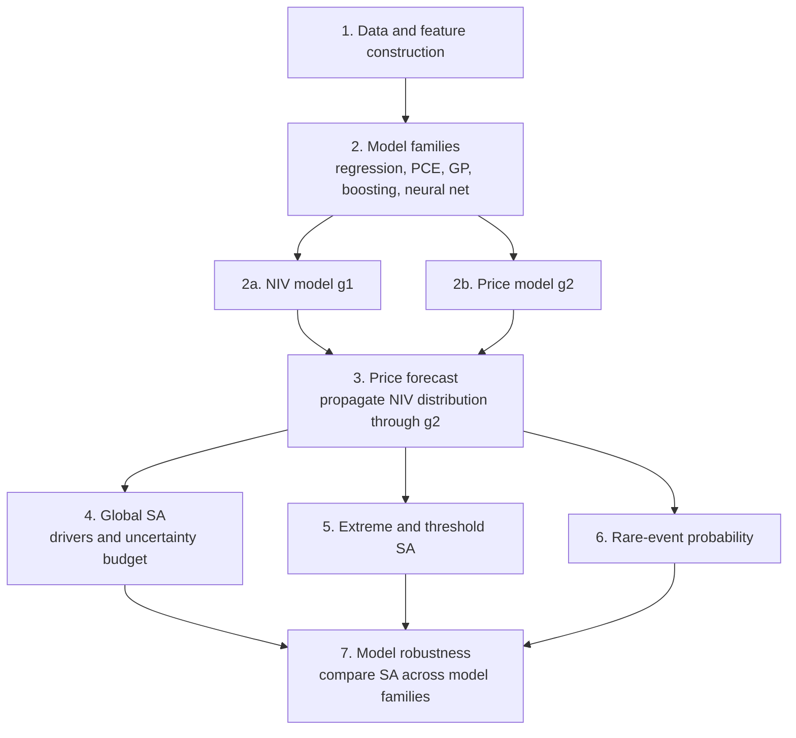

# Thesis Proposal

**Working title:** Sensitivity Analysis of Rare Events in Engineering Systems: Forecasting Extreme Imbalance Prices in the Irish Electricity System

**Author:** Finn O'Connor, MAI Mechanical and Manufacturing Engineering, Trinity College Dublin

**Supervisor:** Dr. Rui Teixeira, E3 Assistant Professor, Civil and Structural, Environmental Engineering

> [!summary] Summary
> The Irish electricity system must balance supply and demand in real time. The energy the system operator has to buy or sell to correct any mismatch is the **Net Imbalance Volume (NIV)**, and the price of doing so is the **imbalance price**. Price depends strongly and non-linearly on NIV: small imbalances are cheap to resolve, but large ones push the operator up a steep cost curve and can cause extreme price spikes.
>
> The thesis will build a two-stage probabilistic model that **forecasts NIV and then forecasts the imbalance price from it**. Sensitivity analysis is applied throughout: to identify which inputs drive NIV and price, which drive **extreme** price events specifically, how much of the forecast uncertainty comes from each stage, and whether these conclusions hold across different model types (regression, polynomial chaos, Gaussian processes, gradient boosting and neural networks).

## 1. The System in Brief

Generators and suppliers schedule themselves in advance based on forecasts of demand and wind generation. Because forecasts are never exact and plant occasionally fails, every half-hour the system ends up short or long of energy. The system operator resolves this by instructing units to increase or decrease output, starting with the cheapest. The larger the imbalance, the further up this cost curve the operator must go, so price rises sharply for large imbalances.

> [!definition] Net Imbalance Volume (NIV)
> The net energy (MWh) the system operator must buy or sell in a half-hour period to keep the system balanced. Its sign shows whether the system was short or long.

> [!definition] Imbalance price
> The price (EUR/MWh) of correcting the imbalance in that period, set by the most expensive action the operator had to take.

## 2. Framing as an Uncertainty Propagation Problem

The forecast is built as a chain of two models:

$$
\underbrace{\mathbf{X}_1}_{\text{inputs known in advance}} \;\xrightarrow{\;g_1\;}\; \underbrace{\widehat{\text{NIV}}}_{\text{probabilistic forecast}} \;\xrightarrow{\;g_2(\,\cdot\,,\;\mathbf{X}_2)\;}\; \underbrace{\widehat{P}}_{\text{price forecast}}
$$

- **$g_1$, the NIV model,** forecasts the distribution of NIV from information available before the period: wind and demand forecasts and how they have recently changed, interconnector schedules, available generation margin, recent NIV and calendar effects.
- **$g_2$, the price model,** maps a given NIV and the system state $\mathbf{X}_2$ (e.g. margin, fuel prices, day-ahead price) to an imbalance price. It is learned from historical observations of NIV and price, and acts as a data-driven model of the operator's cost curve.
- **The price forecast** is obtained by propagating the NIV forecast distribution through $g_2$ by Monte Carlo sampling. This gives a full distribution of possible prices, including the probability of exceeding any chosen price level.

This structure is a standard uncertainty propagation problem: an uncertain intermediate quantity (NIV) passes through a non-linear transfer function ($g_2$) to produce a heavy-tailed output (price). It is well suited to sensitivity analysis because each link can be analysed separately and end to end.

| Component | In this system |
|---|---|
| Uncertain inputs | Forecast information, system state, and the NIV forecast error |
| Intermediate response | NIV |
| Transfer function | Price model $g_2$ (cost curve) |
| Output | Imbalance price |
| Rare event | Price (or NIV) exceeding a threshold $t$ |

## 3. Aim and Research Questions

**Aim.** To develop a probabilistic forecast of the imbalance price driven by NIV, and to use sensitivity analysis to explain what drives the forecast, its uncertainty and its extremes.

1. **Drivers.** Which inputs drive the NIV forecast, and how much of the variability in price is explained by NIV as opposed to the wider system state?
2. **Uncertainty budget.** How much of the uncertainty in the price forecast comes from uncertainty in NIV, and how much from the price model itself?
3. **Extremes.** Are the inputs that drive **extreme** price events the same as those that drive average behaviour, and how does this change with the severity threshold?
4. **Rare-event probability.** How well can the probability of extreme price events be forecast, and how sensitive is it to each input?
5. **Model robustness.** Do the sensitivity results depend on the type of model used, and how much of the variation in results is due to modelling choices rather than the system itself?

## 4. Workflow

### Stage 1: Data and feature construction
- Collect half-hourly historical data: NIV, imbalance price, day-ahead price, wind and demand forecasts and outturns, interconnector flows, available margin, outages and other relevant variable inputs.
- Build the NIV model inputs using **only information available before each period**, so that the forecast is genuinely out-of-sample.
- Characterise the distributions of NIV and price and the relationship between them, especially in the tails.

**Data range and split.** Data cover 1 October 2018 (start of the current market design) to 30 September 2026, eight years or approximately 140,000 half-hour periods. The dataset is fixed at that end date so that results are reproducible. It is split by October–September years so that each set contains a full seasonal cycle (Also EirGrid's financial year):

| Set | Period | Use |
|---|---|---|
| Training | Oct 2018 – Sep 2024 | Model fitting, with rolling-origin backtests |
| Validation | Oct 2024 – Sep 2025 | Model selection and tuning |
| Test | Oct 2025 – Sep 2026 | Final, untouched evaluation |

> [!remark] Structural change: Greenlink interconnector
> The Greenlink interconnector between Ireland and Great Britain entered service on 29 January 2025, adding interconnection capacity part-way through the validation year. A model trained only on earlier data would not have seen this system. This is addressed in four ways:
> 1. **Retraining before testing.** After model selection, final models are refitted on the training and validation data together (October 2018 to September 2025), which includes about eight months of post-Greenlink operation.
> 2. **Interconnection as an input.** Total available interconnector capacity, scheduled interconnector flows and a Greenlink-in-service indicator are included as inputs. Available capacity varied before 2025 due to outages and derating, so its effect can be learned from the full history rather than from the post-Greenlink months alone.
> 3. **Expanding-window backtesting.** Models are retrained at regular intervals during backtesting, so that each period is forecast using all data available up to that point. This shows how quickly the models adapt after the change.
> 4. **Before-and-after comparison.** The distributions of NIV and price, and the sensitivity rankings from Stages 4–6, are compared before and after Greenlink to test whether the additional interconnection changes the drivers and frequency of extreme events.

### Stage 2: Model families
Both $g_1$ and $g_2$ are fitted with a common set of model families, so that their behaviour and their sensitivity results can be compared:

| Model family | Strength | Sensitivity analysis it supports |
|---|---|---|
| Linear / quantile regression | Transparent baseline | Coefficients, standardised effects |
| Polynomial chaos expansion | Smooth global approximation | Sobol indices directly from coefficients |
| Gaussian process | Probabilistic, uncertainty on predictions | Sobol indices with uncertainty bands |
| Gradient-boosted trees | Captures thresholds and non-smooth behaviour | SHAP values, Monte Carlo Sobol |
| Neural network | Flexible, high capacity | Gradient-based measures, Monte Carlo Sobol |

- Models are probabilistic where possible (quantile outputs or predictive distributions), since the tails are the focus.
- Gaussian processes are trained on a subsample or in a sparse approximation, because exact Gaussian processes do not scale to the full dataset.
- All models are validated on held-out time periods using rolling-origin backtesting, with accuracy assessed across the full distribution and specifically in the tails, against simple benchmarks.

### Stage 3: Price forecast
- Sample from the NIV forecast distribution, pass each sample through $g_2$ together with the system state, and collect the resulting prices.
- The result is a predictive distribution of the imbalance price for each period, from which point forecasts, intervals and exceedance probabilities follow.

### Stage 4: Global sensitivity analysis
- **Morris screening** to remove inputs with negligible influence, then **Sobol indices** (first-order and total) on the remaining inputs.
- Applied to each link:
  - $g_1$: which inputs drive the NIV forecast;
  - $g_2$: how much price variability is due to NIV versus system state;
  - full chain: which inputs drive the price forecast overall.
- **Uncertainty budget:** treat NIV forecast uncertainty and price model uncertainty as separate factors and apportion the variance of the price forecast between them. This shows whether better NIV forecasting or a better price model would most improve the price forecast.
- Because the inputs are correlated, compare variance-based indices with methods suited to dependent inputs, such as Shapley effects or grouped indices.

### Stage 5: Extreme-oriented and threshold-based sensitivity analysis
- **Extreme-oriented SA:** fix one input at a time across its range and search over the others for the most extreme price achievable. How much this extreme changes with the fixed input measures that input's influence on extremes.
- **Threshold-based SA:** repeat with the aim of reaching a chosen price threshold rather than the absolute maximum, for several thresholds (moderate, severe, extreme). This shows, for each input, the range of values for which the threshold can or cannot be exceeded.
- Restrict the search to realistic input combinations, using the observed dependence between inputs, so that extremes are plausible.

### Stage 6: Rare-event probability
- Fit extreme value distributions to the tail of the price to estimate how often extreme levels occur.
- Evaluate how well the model forecasts the probability of exceeding each threshold.
- Use efficient sampling methods (importance sampling or subset simulation) on the models to estimate small exceedance probabilities, and compute their sensitivity to each input.
- An example of a rare event in the I-SEM and GB balancing markets when prices exceeded £4,000/MWh due to really low levels of wind generation and available flexible generation.
- Some generators predicted that the NIV would be short and capitalised on it.

### Stage 7: Model robustness
- Repeat Stages 4–6 for each model family and compare the input rankings and their confidence intervals. Agreement across models indicates the result reflects the system; disagreement, likely to be greatest in the tails where data are sparse, is itself a finding.
- Treat the modelling choices (model family, training window, key hyperparameters, threshold definition) as additional factors in a Sobol analysis, to quantify how much of the variation in the results comes from modelling decisions rather than from the physical inputs.
- Compare each model family's own sensitivity measure (e.g. PCE-derived Sobol indices, SHAP values) with standard Monte Carlo Sobol indices on the same model.

## 5. Sensitivity Analysis Overview

| Level | Question | Methods |
|---|---|---|
| NIV model $g_1$ | What drives the NIV forecast? | Morris, Sobol |
| Price model $g_2$ | How much of price is NIV versus system state? | Sobol |
| Full chain | What drives the price forecast? | Sobol, Shapley effects |
| Uncertainty budget | Where does price forecast uncertainty come from? | Grouped Sobol indices |
| Extremes | What drives extreme prices? | Extreme-oriented SA |
| Thresholds | How does this change with severity? | Threshold-based SA |
| Rare events | How sensitive is the probability of a spike to each input? | Rare-event simulation |
| Model choice | Are the conclusions robust to the model used? | Cross-model comparison; modelling choices as Sobol factors |

## 6. Expected Contributions

1. A two-stage probabilistic forecast of imbalance prices driven by NIV, evaluated with particular attention to extreme events.
2. A decomposition of price forecast uncertainty into NIV uncertainty and price model uncertainty.
3. A comparison of the drivers of average and extreme price behaviour, and of how these depend on the severity threshold.
4. An assessment of how robust data-driven sensitivity analysis is to the choice of model, applied to a non-smooth system with dependent inputs.

## 7. Scope

| Level | Content |
|---|---|
| Core | Stages 1–4: data, NIV and price models (at least three model families), price forecast, global SA and uncertainty budget |
| Core | Stage 5: extreme and threshold SA |
| Extension | Stage 6: rare-event probability; Stage 7 with all five model families and modelling choices as factors |

## 8. Risks and Mitigation

| Risk                                                                  | Mitigation                                                                                                                                                       |
| --------------------------------------------------------------------- | ---------------------------------------------------------------------------------------------------------------------------------------------------------------- |
| Historical forecasts not available as originally issued               | Confirm early; use a shorter period if needed                                                                                                                    |
| NIV is hard to forecast in advance                                    | The price model and sensitivity analysis remain valid with wide NIV distributions; quantify how much a better NIV forecast would help via the uncertainty budget |
| Price model inaccurate for extreme NIV values                         | Validate tail accuracy explicitly; model price relative to the day-ahead price; use extreme value theory to support conclusions                                  |
| Gaussian processes and neural networks too costly on the full dataset | Subsample, use sparse approximations, or limit to three model families                                                                                           |
| Market changes over the data period                                   | Include indicators for structural changes; check results on sub-periods                                                                                          |
